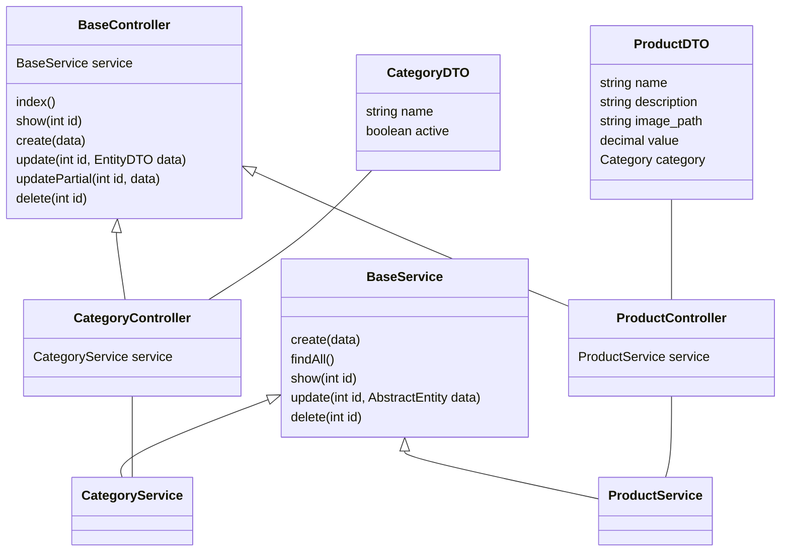

## Estrutura e padrão da API
O projeto esta estruturado em modulo, por exemplo o modulo de produtos possui sua propria pasta, onde contém sua controller, service, arquivos DTOs e Entitys

Cada controller extende da BaseController, herdando seus atributos e metodos. O mesmo que acontece com as controllers ocorre com as services, onde elas extendem da BaseService.

As controllers utilizam-se de entidades DTO para validação de seus campos por meio do Class-Validator.
## Configuração e Instalação
* [Configuração e Instalação](../server/README.md)

### Diagrama da estrutura do projeto



## Testes Unitários
Para executar os testes da aplicação entre no terminal, acesse a pasta e digite os seguintes comandos :
### Testes Controllers
##### Teste product controller 
```bash
npm run test src/products/product/product.controller.spec.ts
```
#### Teste category controller 
```bash
npm run test src/products/category/category.controller.spec.ts
```
### Testes Services
**Cuiddado:** teste de service passando parametro _-- database_ usam do banco de dados, por isso informações podem ser perdidas, faça somente em ambiente de desenvolvimento.
#### Teste product services com mock
Nesse teste todos os dados são preservados, visto que parte da aplicação está mockada
```bash
npm run test src/products/product/product.controller.spec.ts
```
#### Teste product services sem mock
Nesse teste todos os dados possivelmente serão perdidos
```bash
npm run test src/products/product/product.service.spec.ts -- database
```
#### Teste category service com mock
Nesse teste todos os dados são preservados, visto que parte da aplicação está mockada
```bash
npm run test src/products/category/category.service.spec.ts 
```
#### Teste category service sem mock
Nesse teste todos os dados possivelmente serão perdidos
```bash
npm run test src/products/category/category.service.spec.ts  -- database
```
