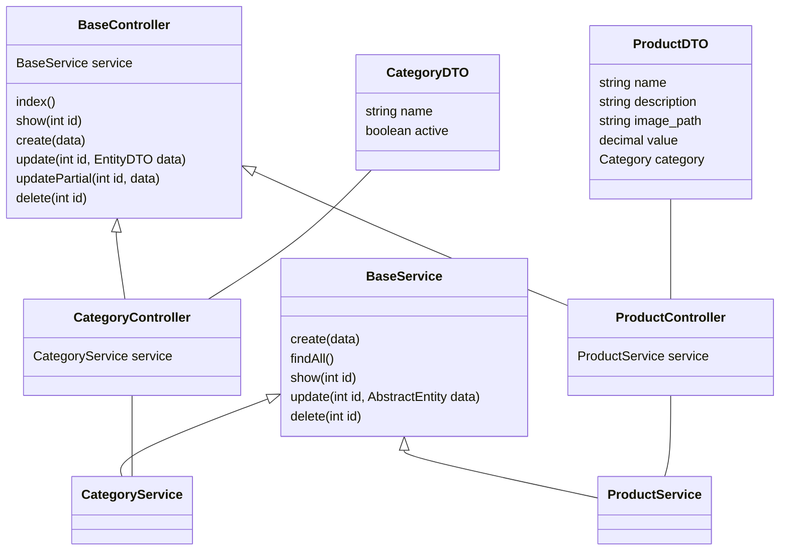

## Estrutura e padrão
O projeto esta estruturado em modulo, por exemplo o modulo de produtos possui sua propria pasta, onde contém sua controller, service, arquivos DTOs e Entitys

Cada controller extende da BaseController, herdando seus atributos e metodos. O mesmo que acontece com as controllers ocorre com as services, onde elas extendem da BaseService.

As controllers utilizam-se de entidades DTO para validação de seus campos por meio do Class-Validator

### Diagrama da estrutura do projeto

