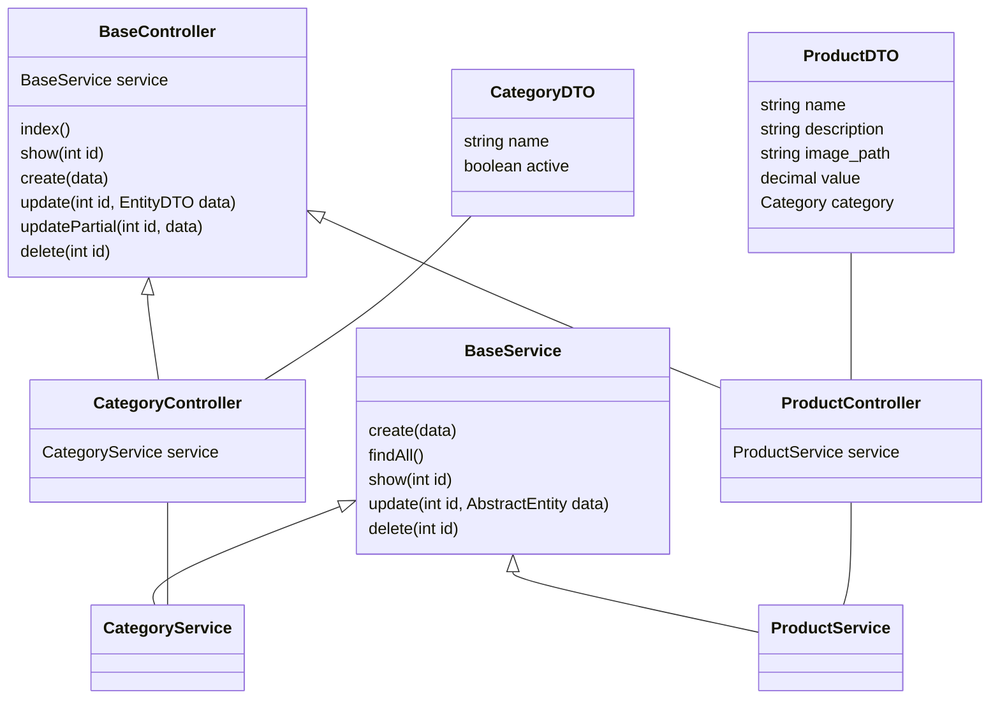

As controllers utilizam-se de entidades DTO para validação de seus campos por meio do Class-Validator.
## Configuração e Instalação
* [Configuração e Instalação](../server/README.md)
  
## Estrutura e padrão da API
O projeto esta estruturado em modulo, por exemplo o modulo de produtos possui sua propria pasta, onde contém sua controller, service, arquivos DTOs e Entitys

Cada controller extende da BaseController, herdando seus atributos e metodos. O mesmo que acontece com as controllers ocorre com as services, onde elas extendem da BaseService.

### Diagrama da estrutura do projeto


## EndPoints

### Produtos
| Req. Http | Url | Função | Exemplos: JSON 
|---| ---| ---| ---|
| POST | /products/product | create(data)|[Create Product ](#create-product) |
| POST | /products/product/photo | upload(file)| |
| GET | /products/product | index()| [Index Product ](#index-product)  |
| GET | /products/product/:id | show(id)| [Show Product ](#show-product)  |
| PUT | /products/product/:id | update(id, data)| [Create Category ](#update-product) |
| DELETE | /products/product/:id | delete(id)| [Delete Product ](#delete) |

### JSON validos para Produtos
#### create product
exemplo de JSON válido para envio via POST
```json
{
        "name": "Mação)",
        "description": "fruta doce",
        "image_path": null,
        "value": 3.55,
        "category": {
            "id": 1,
            "name": "frutas",
            "active": true
        }
}
```
#### update product
exemplo de JSON válido para envio via PUT
```json
{
        "name": "Maçã",
        "description": "fruta doce",
        "image_path": null,
        "value": 3.55,
        "category": {
            "id": 1,
            "name": "frutas",
            "active": true
        }
}
```
#### index product
exemplo de JSON válido recebido via GET
```json
[
    {
      "id": 1,
      "name": "Maçã",
      "description": "fruta doce",
      "image_path": null,
      "value": 3.55,
      "category": {
          "id": 1,
          "name": "frutas",
          "active": true
      }
    },
    {
      "id": 2,
      "name": "Banana",
      "description": "fruta doce",
      "image_path": null,
      "value": 1.65,
      "category": {
          "id": 1,
          "name": "frutas",
          "active": true
      }
    }
]
```

#### show product
exemplo de JSON válido recebido via GET
```json
  {
    "id": 1,
    "name": "Maçã",
    "description": "fruta doce",
    "image_path": null,
    "value": 3.55,
    "category": {
        "id": 1,
        "name": "frutas",
        "active": true
    }
  }
```


### Categorias
| Req. Http | Url | Função | Exemplos: JSON 
|---| ---| ---| ---|
| POST | /products/category | create(data)| [Create Category ](#create-category) |
| GET | /products/category | index()| [Index Category ](#index-category)  |
| GET | /products/category/:id | show(id)| [Show Category ](#show-category) |
| PUT | /products/category/:id | update(id, data)| [Create Category ](#update-category)  |
| DELETE | /products/category/:id | delete(id)| [Delete Category ](#delete) |


### JSON validos para Categoria
#### create category
exemplo de JSON válido para envio via POST
```json
{
    "name": " frutas"
}
```
#### update category
exemplo de JSON válido para envio via PUT
```json
{
    "name": " frutas"
}
```
#### index category
exemplo de JSON válido recebido via GET
```json
[
    {
        "id": 1,
        "name": "frutas",
        "active": true
    },
    {
        "id": 2,
        "name": " verduras",
        "active": true
    }
]
```

#### show category
exemplo de JSON válido recebido via GET
```json
    {
        "id": 1,
        "name": "frutas",
        "active": true
    }
```
#### delete 
exemplo de JSON válido recebido via GET
```json
{
    "generatedMaps": [],
    "raw": [],
    "affected": 1
}
```

## Testes Unitários
Para executar os testes da aplicação entre no terminal, acesse a pasta e digite os seguintes comandos :
### Testes Controllers
##### Teste product controller 
```bash
npm run test src/products/product/product.controller.spec.ts
```
#### Teste category controller 
```bash
npm run test src/products/category/category.controller.spec.ts
```
### Testes Services
**Cuiddado:** teste de service passando parametro _-- database_ usam do banco de dados, por isso informações podem ser perdidas, faça somente em ambiente de desenvolvimento.
#### Teste product services com mock
Nesse teste todos os dados são preservados, visto que parte da aplicação está mockada
```bash
npm run test src/products/product/product.controller.spec.ts
```
#### Teste product services sem mock
Nesse teste todos os dados possivelmente serão perdidos
```bash
npm run test src/products/product/product.service.spec.ts -- database
```
#### Teste category service com mock
Nesse teste todos os dados são preservados, visto que parte da aplicação está mockada
```bash
npm run test src/products/category/category.service.spec.ts 
```
#### Teste category service sem mock
Nesse teste todos os dados possivelmente serão perdidos
```bash
npm run test src/products/category/category.service.spec.ts  -- database
```
